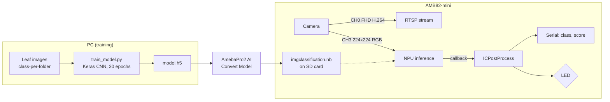
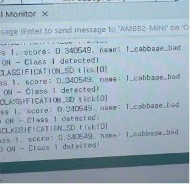
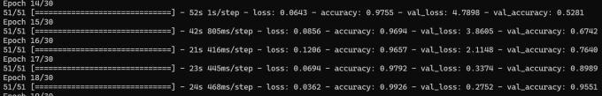

# AMB82-mini On-device Plant Disease Detection

> A camera-to-LED plant disease classifier that runs entirely on the 0.4 TOPS NPU of a Realtek AMB82-mini:
> TensorFlow CNN → AmebaPro2 `.nb` → Arduino C++ firmware → Serial / LED output.
>
> 한국어 버전은 [아래](#한국어-korean)에 있습니다.

   

| Metric | Value |
|---|---:|
| Unseen-image test (end-to-end, camera → NPU → LED) | **17 / 20 = 85 %** |
| Target set at project start | ≥ 85 % |
| Inference location | On-board NPU, no image leaves the device |
| Model on device | `imgclassification.nb`, ~5.6 MB, 2 classes |

Course: Embedded Systems Experiment, 2025-09 to 2025-12. **Team project (2 members).**

## Highlights

- **85 % on 20 images the model had never seen**, measured through the whole deployed path (camera frame → NPU → class mapping → LED), not on the Keras validation split.
- **First plan failed and was replaced.** A Teachable Machine `.h5` was rejected by Realtek's converter, so the team wrote and trained the CNN by hand in Keras to get a graph the converter accepts.
- **Camera / NPU / output integration on real hardware**: two camera channels (FHD RTSP preview + 224×224 NN feed), callback-driven inference, LED warning. `loop()` is empty.

## Overview

Home and urban growers often cannot tell whether a leaf is diseased until the plant is lost. The project puts a small
image classifier on an AMB82-mini so that pointing the board camera at a leaf gives an immediate local verdict:
the serial monitor prints the class and score, and the built-in LED turns on when the leaf is classified as diseased.

Design constraints that shaped the work:

- inference must happen on the board (privacy, no network dependency in the decision path);
- the model must survive Realtek's `.h5` → `.nb` conversion, which limits the TensorFlow version and graph style;
- the training normalization, converter scale and firmware channel settings must agree exactly.

## System / Architecture



Details: [`docs/system_architecture.md`](docs/system_architecture.md), [`docs/deployment_pipeline.md`](docs/deployment_pipeline.md).

## Environment

| Category | Stack |
|---|---|
| Hardware | Realtek AMB82-mini (0.4 TOPS NPU, on-board camera), SD card (FAT32), built-in LED |
| Training | Python 3.10 (conda), TensorFlow 2.14.1, Keras `ImageDataGenerator` |
| Conversion | AmebaPro2 AI Convert Model (CNN-RGB, scale 1/255) |
| Firmware | Arduino IDE, C++, Realtek Ameba Arduino SDK (`VideoStream`, `StreamIO`, `NNImageClassification`, `RTSP`) |
| Input / output | 224×224 RGB frames at 10 fps → class id + score on serial, LED on/off |

## My Contribution

This was a two-person team project. From the final report's role table, my parts were:

- collecting and labeling the healthy / diseased leaf image dataset (about 300 images per class);
- co-writing the Arduino C++ firmware (camera channel setup, NPU callback, class mapping, LED/serial output);
- producing the presentation material.

A teammate led the CNN training and tuning and ran the on-site test and demo at an apartment-complex garden.
The `.h5` → `.nb` conversion and board deployment were done together while debugging the pipeline.

## Implementation

1. **Data**: images gathered from web image search, one folder per class (`0_cabbage_good`, `1_cabbage_bad`), resized to 224×224 and normalized by 1/255. Training-only augmentation: flips, shear, zoom, shifts.
2. **Model** (`training/train_model.py`): six `Conv2D → MaxPool → BatchNorm` blocks (16 → 512 filters), `Flatten`, `Dense(1024)`, `Dense(64)`, `Dense(NUM_CLASSES, softmax)`; Adam, categorical cross-entropy, 30 epochs, batch 16, 10 % validation split.
3. **Conversion** (`model/model_conversion.md`): zip `model.h5`, convert as CNN-RGB with `reverse_channel=false`, `scale=0.00392157`, one calibration image; rename to `imgclassification.nb`; copy to `NN_MDL/` on the SD card; select "NN Model Load From: SD Card" in Arduino IDE.
4. **Firmware** (`firmware/plant_disease_classifier/`): CH0 (FHD, H.264) → RTSP; CH3 (224×224 RGB) → `NNImageClassification`. The NPU calls `ICPostProcess()` after each inference; it prints `class, score, name` and drives the LED from `class_id`.
5. **Class table** (`ClassificationClassList.h`): index → name → enable flag; must mirror the training folder order.

## Challenge

The original plan was no-code: export an `.h5` from Teachable Machine and convert it. The converter refused the file.
Teachable Machine wraps the network in browser-oriented metadata and wrapper layers, so the tool could not find the plain
convolutional graph it expects. Simply retrying with different export options did not help.

## Approach

- Dropped the no-code path and wrote the CNN in Keras so that every property the converter cares about (input size,
  normalization scale, channel order, output layer) was an explicit line of code.
- Pinned TensorFlow to 2.14.1, the highest version the converter accepted.
- Treated training script, converter fields and firmware defines as one contract (see the table in
  `docs/deployment_pipeline.md`); a mismatch there produces wrong predictions, not an error, so it was checked as a set.
- Verified on the board, not in Python: serial output and LED state for known healthy / diseased samples.

## Validation

The final system was tested with **20 cabbage images not used for training (10 per class)** shown to the board camera.
The printed class name was compared with the true label.

| | Value |
|---|---:|
| Correct | 17 |
| Total | 20 |
| Accuracy | **85 %** |

This is an end-to-end number covering camera input, NPU inference, class mapping and LED/serial output. The test set is
small, so the figure carries wide uncertainty. Details: [`docs/validation.md`](docs/validation.md).

<p>


</p>

## Results

- Project goal (≥ 85 % recognition) met at exactly 85 % on the unseen test.
- Healthy cabbage → `0_cabbage_good`, LED off. Rotten cabbage → `1_cabbage_bad`, blue LED on.
- Same script and pipeline reused for a tomato model (healthy / mosaic virus / yellow leaf curl); two disease images
  shown on a monitor were classified correctly. No quantitative test for this model.

## What I Learned

1. **A model is only deployed when the whole chain agrees.** Input size, 1/255 scale, channel order and class order each
   live in three places (script, converter, firmware); every new model had to be checked across all three.
2. **No-code tools hide the parts an embedded target needs.** Owning the graph in Keras was what made the conversion work.
3. **Validate on the target with unseen inputs.** Keras validation accuracy said little about what the NPU did with real
   camera frames; the 20-image on-device test was the number that mattered.
4. **Small NPUs set the task scope.** 0.4 TOPS was enough for 2-class classification but not for detection or
   segmentation; a hybrid edge/server split is the realistic upgrade path.

## Repository Structure

```
amb82-plant-disease-ondevice-ai/
├── README.md
├── LICENSE
├── .gitignore
├── training/
│   ├── train_model.py          # Keras CNN, saves model.h5
│   ├── requirements.txt        # tensorflow==2.14.1
│   └── README.md               # dataset layout, settings
├── firmware/
│   └── plant_disease_classifier/
│       ├── plant_disease_classifier.ino
│       ├── ClassificationClassList.h
│       └── wifi_config.h.example   # copy to wifi_config.h (git-ignored)
├── model/
│   ├── README.md               # which models exist, why binaries are absent
│   └── model_conversion.md     # .h5 -> .nb procedure and settings
├── docs/
│   ├── system_architecture.md
│   ├── deployment_pipeline.md
│   └── validation.md
└── assets/                     # own screenshots / photos from the project
```

Not included: the training images (web-sourced, not redistributable), `model.h5` (~25 MB) and `imgclassification.nb`
(~5.6 MB). Both binaries are regenerable with the steps above.

## Reproduction

Hardware required: AMB82-mini, SD card, USB cable. The steps below were not re-run during the 2026 cleanup.

```bash
# 1. train
conda create -n amb82 python=3.10 && conda activate amb82
pip install -r training/requirements.txt
# put images in training/dataset/<idx>_<name>/ and set NUM_CLASSES
python training/train_model.py            # -> model.h5

# 2. convert: zip model.h5, upload to AmebaPro2 AI Convert Model (see model/model_conversion.md)
#    rename result to imgclassification.nb, copy to SD:/NN_MDL/

# 3. flash
cp firmware/plant_disease_classifier/wifi_config.h.example firmware/plant_disease_classifier/wifi_config.h
#    edit SSID/password, open the sketch in Arduino IDE (Ameba board package),
#    Tools -> NN Model Load From -> SD Card, upload, open Serial Monitor at 115200
```

## Future Work (not implemented)

Planned in the proposal but not built, listed here so they are not mistaken for delivered features:

- mobile app (Flutter) showing the diagnosis result;
- result storage in Firebase;
- weather Open API integration;
- humidity-sensor-driven irrigation control.

## Notes / Limitations

- Two-class cabbage model trained on ~600 web images; generalization beyond that set is unverified.
- 0.4 TOPS limits the task to classification; object detection or segmentation would need a stronger edge device or a hybrid design.
- 8-bit quantization during `.nb` conversion may lose small early-stage lesions.
- Wi-Fi is required only for the RTSP preview; the classifier itself does not use the network.
- Portfolio cleanup (2026): the hard-coded Wi-Fi credentials were moved to a git-ignored header and an absolute dataset path was made relative. No logic was changed.

## License

MIT. See [`LICENSE`](LICENSE).

---

## 한국어 (Korean)

### AMB82-mini 온디바이스 식물 질병 판별

> Realtek AMB82-mini의 0.4 TOPS NPU에서 전부 동작하는 카메라-LED 식물 질병 분류기:
> TensorFlow CNN → AmebaPro2 `.nb` → Arduino C++ 펌웨어 → Serial / LED 출력.

| 지표 | 값 |
|---|---:|
| 미사용 이미지 테스트 (end-to-end, 카메라 → NPU → LED) | **17 / 20 = 85 %** |
| 프로젝트 시작 시 설정한 목표 | ≥ 85 % |
| 추론 위치 | 보드 내부 NPU, 이미지가 장치 밖으로 나가지 않음 |
| 보드에 탑재된 모델 | `imgclassification.nb`, 약 5.6 MB, 2 클래스 |

과목: 임베디드시스템실험, 2025-09 ~ 2025-12. **팀 프로젝트 (2인).**

### Highlights

- **모델이 한 번도 본 적 없는 이미지 20장에서 85 %**. Keras validation split이 아니라 실제 배포 경로 전체(카메라 프레임 → NPU → 클래스 매핑 → LED)를 거쳐 측정했다.
- **첫 계획은 실패했고 교체했다.** Teachable Machine에서 만든 `.h5`가 Realtek converter에서 거부되어, converter가 받아들이는 그래프를 얻기 위해 팀이 Keras로 CNN을 직접 작성하고 학습했다.
- **실제 하드웨어에서 카메라 / NPU / 출력 통합**: 카메라 채널 2개(FHD RTSP 미리보기 + 224×224 NN 입력), callback 기반 추론, LED 경고. `loop()`는 비어 있다.

### Overview

가정이나 도시에서 식물을 키우는 사람은 잎이 병들었는지 식물을 잃기 전까지 알기 어려운 경우가 많다. 이 프로젝트는 AMB82-mini에 작은 이미지 분류기를 올려, 보드 카메라를 잎에 비추면 즉시 로컬에서 판정이 나오도록 한다. 시리얼 모니터에 클래스와 score가 출력되고, 잎이 질병으로 분류되면 내장 LED가 켜진다.

작업 방향을 결정한 설계 제약:

- 추론은 보드에서 이루어져야 한다 (프라이버시, 판정 경로에 네트워크 의존 없음);
- 모델은 Realtek의 `.h5` → `.nb` 변환을 통과해야 하며, 이 때문에 TensorFlow 버전과 그래프 형태가 제한된다;
- 학습 시 normalization, converter의 scale, 펌웨어의 채널 설정이 정확히 일치해야 한다.

### System / Architecture


상세: [`docs/system_architecture.md`](docs/system_architecture.md), [`docs/deployment_pipeline.md`](docs/deployment_pipeline.md).

### Environment

| 구분 | 스택 |
|---|---|
| 하드웨어 | Realtek AMB82-mini (0.4 TOPS NPU, 온보드 카메라), SD 카드 (FAT32), 내장 LED |
| 학습 | Python 3.10 (conda), TensorFlow 2.14.1, Keras `ImageDataGenerator` |
| 변환 | AmebaPro2 AI Convert Model (CNN-RGB, scale 1/255) |
| 펌웨어 | Arduino IDE, C++, Realtek Ameba Arduino SDK (`VideoStream`, `StreamIO`, `NNImageClassification`, `RTSP`) |
| 입력 / 출력 | 224×224 RGB 프레임 10 fps → 시리얼에 class id + score, LED on/off |

### My Contribution

2인 팀 프로젝트였다. 최종 보고서의 역할표 기준으로 내가 맡은 부분은 다음과 같다.

- 정상 / 질병 잎 이미지 데이터셋 수집 및 라벨링 (클래스당 약 300장);
- Arduino C++ 펌웨어 공동 작성 (카메라 채널 설정, NPU callback, 클래스 매핑, LED/시리얼 출력);
- 발표자료 제작.

CNN 학습과 튜닝, 그리고 아파트 단지 농장에서의 현장 테스트와 시연은 팀원이 주도했다.
`.h5` → `.nb` 변환과 보드 배포는 파이프라인을 디버깅하면서 함께 진행했다.

### Implementation

1. **데이터**: 웹 이미지 검색으로 수집한 이미지를 클래스별 폴더(`0_cabbage_good`, `1_cabbage_bad`)에 두고, 224×224로 리사이즈한 뒤 1/255로 normalization. 학습 데이터에만 augmentation 적용: flip, shear, zoom, shift.
2. **모델** (`training/train_model.py`): `Conv2D → MaxPool → BatchNorm` 블록 6개 (16 → 512 filters), `Flatten`, `Dense(1024)`, `Dense(64)`, `Dense(NUM_CLASSES, softmax)`; Adam, categorical cross-entropy, 30 epochs, batch 16, 10 % validation split.
3. **변환** (`model/model_conversion.md`): `model.h5`를 zip으로 압축하고, CNN-RGB로 `reverse_channel=false`, `scale=0.00392157`, calibration 이미지 1장으로 변환; 결과를 `imgclassification.nb`로 이름 변경; SD 카드의 `NN_MDL/`에 복사; Arduino IDE에서 "NN Model Load From: SD Card" 선택.
4. **펌웨어** (`firmware/plant_disease_classifier/`): CH0 (FHD, H.264) → RTSP; CH3 (224×224 RGB) → `NNImageClassification`. NPU는 추론이 끝날 때마다 `ICPostProcess()`를 호출하며, 이 함수는 `class, score, name`을 출력하고 `class_id`에 따라 LED를 제어한다.
5. **클래스 테이블** (`ClassificationClassList.h`): index → name → enable flag; 학습 폴더 순서와 동일해야 한다.

### Challenge

원래 계획은 no-code였다. Teachable Machine에서 `.h5`를 내보내 변환하는 방식이었으나 converter가 파일을 거부했다.
Teachable Machine은 네트워크를 브라우저 지향 메타데이터와 wrapper layer로 감싸기 때문에, 툴이 기대하는 순수한
convolutional graph를 찾지 못했다. export 옵션을 바꿔 다시 시도해도 해결되지 않았다.

### Approach

- no-code 경로를 버리고 Keras로 CNN을 작성해, converter가 요구하는 모든 속성(입력 크기, normalization scale, 채널 순서, 출력 레이어)이 코드 한 줄로 명시되도록 했다.
- TensorFlow를 converter가 허용하는 최고 버전인 2.14.1로 고정했다.
- 학습 스크립트, converter 입력 항목, 펌웨어 define을 하나의 계약으로 취급했다 (`docs/deployment_pipeline.md`의 표 참조). 여기서 불일치가 생기면 에러가 아니라 잘못된 예측이 나오므로 세트로 점검했다.
- Python이 아니라 보드에서 검증했다: 정상 / 질병으로 알려진 샘플에 대한 시리얼 출력과 LED 상태.

### Validation

최종 시스템은 **학습에 사용하지 않은 배추 이미지 20장(클래스당 10장)** 을 보드 카메라에 보여주는 방식으로 테스트했다.
출력된 클래스 이름을 실제 라벨과 비교했다.

| | 값 |
|---|---:|
| 정답 | 17 |
| 전체 | 20 |
| 정확도 | **85 %** |

이 수치는 카메라 입력, NPU 추론, 클래스 매핑, LED/시리얼 출력을 모두 포함한 end-to-end 결과다. 테스트 세트가 작으므로
불확실성이 크다. 상세: [`docs/validation.md`](docs/validation.md).

<p>


</p>

### Results

- 프로젝트 목표(인식률 ≥ 85 %)를 미사용 이미지 테스트에서 정확히 85 %로 달성했다.
- 정상 배추 → `0_cabbage_good`, LED off. 썩은 배추 → `1_cabbage_bad`, 파란 LED on.
- 같은 스크립트와 파이프라인을 토마토 모델(정상 / 모자이크 바이러스 / 황화 잎말림 바이러스)에도 재사용했다. 모니터에 띄운 질병 이미지 2장이 올바르게 분류되었다. 이 모델에 대한 정량 테스트는 없다.

### What I Learned

1. **모델은 전체 체인이 일치할 때만 배포된 것이다.** 입력 크기, 1/255 scale, 채널 순서, 클래스 순서가 각각 세 곳(스크립트, converter, 펌웨어)에 존재하므로, 새 모델마다 세 곳을 모두 확인해야 했다.
2. **no-code 툴은 임베디드 타겟에 필요한 부분을 숨긴다.** Keras에서 그래프를 직접 소유한 것이 변환을 성공시킨 요인이었다.
3. **타겟에서 미사용 입력으로 검증한다.** Keras validation accuracy는 NPU가 실제 카메라 프레임으로 무엇을 하는지 거의 말해주지 않았다. 온디바이스 20장 테스트가 의미 있는 수치였다.
4. **작은 NPU가 과제 범위를 정한다.** 0.4 TOPS는 2-class 분류에는 충분했지만 detection이나 segmentation에는 부족했다. 현실적인 확장 경로는 edge/server hybrid 구성이다.

### Repository Structure

```
amb82-plant-disease-ondevice-ai/
├── README.md
├── LICENSE
├── .gitignore
├── training/
│   ├── train_model.py          # Keras CNN, saves model.h5
│   ├── requirements.txt        # tensorflow==2.14.1
│   └── README.md               # dataset layout, settings
├── firmware/
│   └── plant_disease_classifier/
│       ├── plant_disease_classifier.ino
│       ├── ClassificationClassList.h
│       └── wifi_config.h.example   # copy to wifi_config.h (git-ignored)
├── model/
│   ├── README.md               # which models exist, why binaries are absent
│   └── model_conversion.md     # .h5 -> .nb procedure and settings
├── docs/
│   ├── system_architecture.md
│   ├── deployment_pipeline.md
│   └── validation.md
└── assets/                     # own screenshots / photos from the project
```

포함되지 않은 것: 학습 이미지(웹에서 수집, 재배포 불가), `model.h5` (약 25 MB), `imgclassification.nb` (약 5.6 MB).
두 바이너리는 위 절차로 다시 생성할 수 있다.

### Reproduction

필요한 하드웨어: AMB82-mini, SD 카드, USB 케이블. 아래 절차는 2026년 정리 작업 시 다시 실행하지 않았다.

```bash
# 1. train
conda create -n amb82 python=3.10 && conda activate amb82
pip install -r training/requirements.txt
# put images in training/dataset/<idx>_<name>/ and set NUM_CLASSES
python training/train_model.py            # -> model.h5

# 2. convert: zip model.h5, upload to AmebaPro2 AI Convert Model (see model/model_conversion.md)
#    rename result to imgclassification.nb, copy to SD:/NN_MDL/

# 3. flash
cp firmware/plant_disease_classifier/wifi_config.h.example firmware/plant_disease_classifier/wifi_config.h
#    edit SSID/password, open the sketch in Arduino IDE (Ameba board package),
#    Tools -> NN Model Load From -> SD Card, upload, open Serial Monitor at 115200
```

### Future Work (미구현)

제안서에는 계획되어 있었지만 구현하지 않은 항목이다. 완성된 기능으로 오해하지 않도록 여기에 적어 둔다.

- 진단 결과를 보여주는 모바일 앱 (Flutter);
- Firebase에 결과 저장;
- 날씨 Open API 연동;
- 습도 센서 기반 관개 제어.

### Notes / Limitations

- 웹 이미지 약 600장으로 학습한 2-class 배추 모델이다. 그 범위를 벗어난 일반화 성능은 검증되지 않았다.
- 0.4 TOPS는 과제를 분류로 제한한다. object detection이나 segmentation에는 더 강한 edge 장치나 hybrid 설계가 필요하다.
- `.nb` 변환 시 8-bit quantization으로 초기 단계의 작은 병반을 놓칠 수 있다.
- Wi-Fi는 RTSP 미리보기에만 필요하다. 분류기 자체는 네트워크를 사용하지 않는다.
- 포트폴리오 정리 (2026): 하드코딩되어 있던 Wi-Fi 자격 증명을 git-ignored 헤더로 옮기고, 절대 경로였던 데이터셋 경로를 상대 경로로 바꿨다. 로직은 변경하지 않았다.

### License

MIT. [`LICENSE`](LICENSE) 참조.
