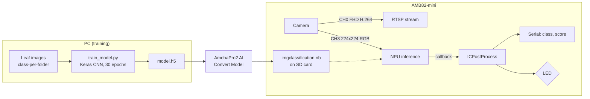

# AMB82-mini On-device Plant Disease Detection

> A camera-to-LED plant disease classifier that runs entirely on the 0.4 TOPS NPU of a Realtek AMB82-mini:
> TensorFlow CNN → AmebaPro2 `.nb` → Arduino C++ firmware → Serial / LED output.

   

| Metric | Value |
|---|---:|
| Unseen-image test (end-to-end, camera → NPU → LED) | **17 / 20 = 85 %** |
| Target set at project start | ≥ 85 % |
| Inference location | On-board NPU, no image leaves the device |
| Model on device | `imgclassification.nb`, ~5.6 MB, 2 classes |

Course: Embedded Systems Experiment, 2025-09 to 2025-12. **Team project (2 members).**

## Highlights

- **85 % on 20 images the model had never seen**, measured through the whole deployed path (camera frame → NPU → class mapping → LED), not on the Keras validation split.
- **First plan failed and was replaced.** A Teachable Machine `.h5` was rejected by Realtek's converter, so the team wrote and trained the CNN by hand in Keras to get a graph the converter accepts.
- **Camera / NPU / output integration on real hardware**: two camera channels (FHD RTSP preview + 224×224 NN feed), callback-driven inference, LED warning. `loop()` is empty.

## Overview

Home and urban growers often cannot tell whether a leaf is diseased until the plant is lost. The project puts a small
image classifier on an AMB82-mini so that pointing the board camera at a leaf gives an immediate local verdict:
the serial monitor prints the class and score, and the built-in LED turns on when the leaf is classified as diseased.

Design constraints that shaped the work:

- inference must happen on the board (privacy, no network dependency in the decision path);
- the model must survive Realtek's `.h5` → `.nb` conversion, which limits the TensorFlow version and graph style;
- the training normalization, converter scale and firmware channel settings must agree exactly.

## System / Architecture



Details: [`docs/system_architecture.md`](docs/system_architecture.md), [`docs/deployment_pipeline.md`](docs/deployment_pipeline.md).

## Environment

| Category | Stack |
|---|---|
| Hardware | Realtek AMB82-mini (0.4 TOPS NPU, on-board camera), SD card (FAT32), built-in LED |
| Training | Python 3.10 (conda), TensorFlow 2.14.1, Keras `ImageDataGenerator` |
| Conversion | AmebaPro2 AI Convert Model (CNN-RGB, scale 1/255) |
| Firmware | Arduino IDE, C++, Realtek Ameba Arduino SDK (`VideoStream`, `StreamIO`, `NNImageClassification`, `RTSP`) |
| Input / output | 224×224 RGB frames at 10 fps → class id + score on serial, LED on/off |

## My Contribution

This was a two-person team project. From the final report's role table, my parts were:

- collecting and labeling the healthy / diseased leaf image dataset (about 300 images per class);
- co-writing the Arduino C++ firmware (camera channel setup, NPU callback, class mapping, LED/serial output);
- producing the presentation material.

A teammate led the CNN training and tuning and ran the on-site test and demo at an apartment-complex garden.
The `.h5` → `.nb` conversion and board deployment were done together while debugging the pipeline.

## Implementation

1. **Data**: images gathered from web image search, one folder per class (`0_cabbage_good`, `1_cabbage_bad`), resized to 224×224 and normalized by 1/255. Training-only augmentation: flips, shear, zoom, shifts.
2. **Model** (`training/train_model.py`): six `Conv2D → MaxPool → BatchNorm` blocks (16 → 512 filters), `Flatten`, `Dense(1024)`, `Dense(64)`, `Dense(NUM_CLASSES, softmax)`; Adam, categorical cross-entropy, 30 epochs, batch 16, 10 % validation split.
3. **Conversion** (`model/model_conversion.md`): zip `model.h5`, convert as CNN-RGB with `reverse_channel=false`, `scale=0.00392157`, one calibration image; rename to `imgclassification.nb`; copy to `NN_MDL/` on the SD card; select "NN Model Load From: SD Card" in Arduino IDE.
4. **Firmware** (`firmware/plant_disease_classifier/`): CH0 (FHD, H.264) → RTSP; CH3 (224×224 RGB) → `NNImageClassification`. The NPU calls `ICPostProcess()` after each inference; it prints `class, score, name` and drives the LED from `class_id`.
5. **Class table** (`ClassificationClassList.h`): index → name → enable flag; must mirror the training folder order.

## Challenge

The original plan was no-code: export an `.h5` from Teachable Machine and convert it. The converter refused the file.
Teachable Machine wraps the network in browser-oriented metadata and wrapper layers, so the tool could not find the plain
convolutional graph it expects. Simply retrying with different export options did not help.

## Approach

- Dropped the no-code path and wrote the CNN in Keras so that every property the converter cares about (input size,
  normalization scale, channel order, output layer) was an explicit line of code.
- Pinned TensorFlow to 2.14.1, the highest version the converter accepted.
- Treated training script, converter fields and firmware defines as one contract (see the table in
  `docs/deployment_pipeline.md`); a mismatch there produces wrong predictions, not an error, so it was checked as a set.
- Verified on the board, not in Python: serial output and LED state for known healthy / diseased samples.

## Validation

The final system was tested with **20 cabbage images not used for training (10 per class)** shown to the board camera.
The printed class name was compared with the true label.

| | Value |
|---|---:|
| Correct | 17 |
| Total | 20 |
| Accuracy | **85 %** |

This is an end-to-end number covering camera input, NPU inference, class mapping and LED/serial output. The test set is
small, so the figure carries wide uncertainty. Details: [`docs/validation.md`](docs/validation.md).

<p>


</p>

## Results

- Project goal (≥ 85 % recognition) met at exactly 85 % on the unseen test.
- Healthy cabbage → `0_cabbage_good`, LED off. Rotten cabbage → `1_cabbage_bad`, blue LED on.
- Same script and pipeline reused for a tomato model (healthy / mosaic virus / yellow leaf curl); two disease images
  shown on a monitor were classified correctly. No quantitative test for this model.

## What I Learned

1. **A model is only deployed when the whole chain agrees.** Input size, 1/255 scale, channel order and class order each
   live in three places (script, converter, firmware); every new model had to be checked across all three.
2. **No-code tools hide the parts an embedded target needs.** Owning the graph in Keras was what made the conversion work.
3. **Validate on the target with unseen inputs.** Keras validation accuracy said little about what the NPU did with real
   camera frames; the 20-image on-device test was the number that mattered.
4. **Small NPUs set the task scope.** 0.4 TOPS was enough for 2-class classification but not for detection or
   segmentation; a hybrid edge/server split is the realistic upgrade path.

## Repository Structure

```
amb82-plant-disease-ondevice-ai/
├── README.md
├── LICENSE
├── .gitignore
├── training/
│   ├── train_model.py          # Keras CNN, saves model.h5
│   ├── requirements.txt        # tensorflow==2.14.1
│   └── README.md               # dataset layout, settings
├── firmware/
│   └── plant_disease_classifier/
│       ├── plant_disease_classifier.ino
│       ├── ClassificationClassList.h
│       └── wifi_config.h.example   # copy to wifi_config.h (git-ignored)
├── model/
│   ├── README.md               # which models exist, why binaries are absent
│   └── model_conversion.md     # .h5 -> .nb procedure and settings
├── docs/
│   ├── system_architecture.md
│   ├── deployment_pipeline.md
│   └── validation.md
└── assets/                     # own screenshots / photos from the project
```

Not included: the training images (web-sourced, not redistributable), `model.h5` (~25 MB) and `imgclassification.nb`
(~5.6 MB). Both binaries are regenerable with the steps above.

## Reproduction

Hardware required: AMB82-mini, SD card, USB cable. The steps below were not re-run during the 2026 cleanup.

```bash
# 1. train
conda create -n amb82 python=3.10 && conda activate amb82
pip install -r training/requirements.txt
# put images in training/dataset/<idx>_<name>/ and set NUM_CLASSES
python training/train_model.py            # -> model.h5

# 2. convert: zip model.h5, upload to AmebaPro2 AI Convert Model (see model/model_conversion.md)
#    rename result to imgclassification.nb, copy to SD:/NN_MDL/

# 3. flash
cp firmware/plant_disease_classifier/wifi_config.h.example firmware/plant_disease_classifier/wifi_config.h
#    edit SSID/password, open the sketch in Arduino IDE (Ameba board package),
#    Tools -> NN Model Load From -> SD Card, upload, open Serial Monitor at 115200
```

## Future Work (not implemented)

Planned in the proposal but not built, listed here so they are not mistaken for delivered features:

- mobile app (Flutter) showing the diagnosis result;
- result storage in Firebase;
- weather Open API integration;
- humidity-sensor-driven irrigation control.

## Notes / Limitations

- Two-class cabbage model trained on ~600 web images; generalization beyond that set is unverified.
- 0.4 TOPS limits the task to classification; object detection or segmentation would need a stronger edge device or a hybrid design.
- 8-bit quantization during `.nb` conversion may lose small early-stage lesions.
- Wi-Fi is required only for the RTSP preview; the classifier itself does not use the network.
- Portfolio cleanup (2026): the hard-coded Wi-Fi credentials were moved to a git-ignored header and an absolute dataset path was made relative. No logic was changed.

## License

MIT. See [`LICENSE`](LICENSE).
