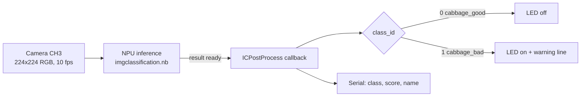

# System architecture

## Hardware

| Item | Detail |
|---|---|
| Board | Realtek AMB82-mini IoT camera board |
| NPU | 0.4 TOPS |
| Camera | On-board camera module |
| Output | Built-in LED (`LED_BUILTIN`), USB serial |
| Storage | SD card (FAT32) holding `NN_MDL/imgclassification.nb` |
| Network | Wi-Fi, used only for the RTSP monitoring stream |

## Two camera channels

The firmware configures two independent video channels from the same sensor:

```
Camera sensor
├── CH0  FHD 1920x1080, 30 fps, H.264, 2 Mbps  ->  RTSP server  (monitoring from a PC)
└── CH3  224x224, 10 fps, raw RGB               ->  NNImageClassification (NPU)
```

`StreamIO` objects link each channel to its consumer. The NN channel gets its own task stack and
priority (`setStackSize()`, `setTaskPriority()`).

## Runtime flow



`loop()` is empty. All work is driven by the camera/NPU pipeline and the result callback registered with
`imgclass.setResultCallback(ICPostProcess)`.

## Class mapping

`ClassificationClassList.h` maps NPU output indices to names. The `filter` flag lets a class be ignored
in post-processing; both cabbage classes are enabled. The index order must match the order of the class
folders used during training (alphabetical, hence the `0_` / `1_` prefixes).

## Why on-device

* No image leaves the board; only a class label and score are printed.
* No network round-trip in the decision path, so the LED responds as soon as an inference completes.
* Wi-Fi is only needed for the optional RTSP preview.
